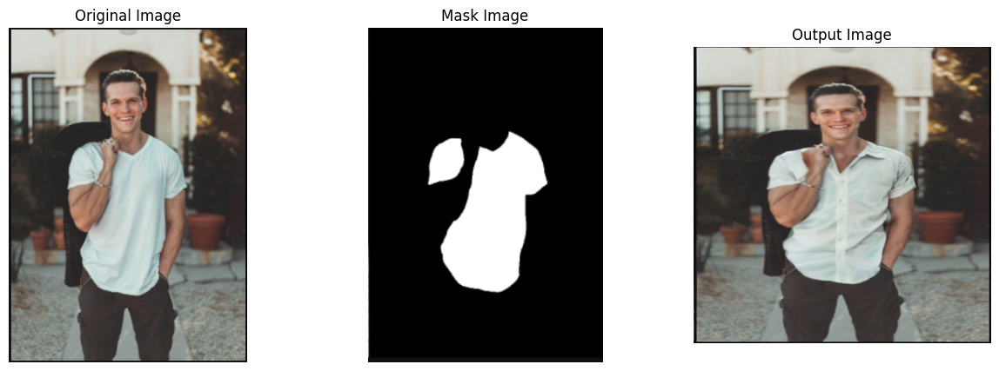
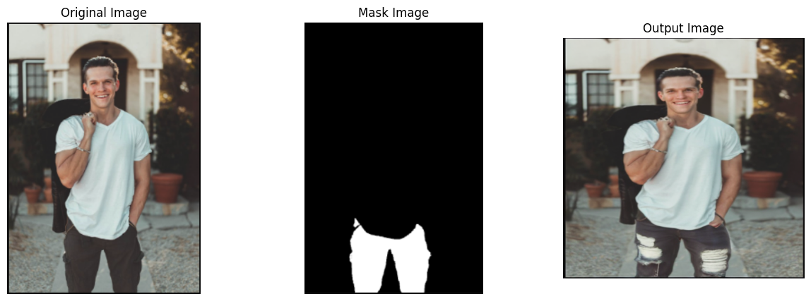

# AI Wardroable Wizard

AI Wardroable Wizard is a cutting-edge application that leverages the Stable Diffusion model for clothing and wardrobe manipulation. By combining real images with masked segments, this provide a seamless and intelligent way to change or enhance specific parts of an image.

## Overview

This project uses the Stable Diffusion model for image inpainting, allowing users to alter specific parts of an image with high precision. The process involves:

1. **Input Images**: Providing a real image and a corresponding masked image where the changes are desired.
2. **Masking**: Performing masking operations using OpenCV to prepare the input images.
3. **Inpainting**: Using Stable Diffusion for generating the output with prompt engineering.
4. **Output**: Receiving the modified image that reflects the desired changes.

## Features

- **Stable Diffusion Inpainting**: Utilize the power of Stable Diffusion to modify specific parts of an image.
- **OpenCV Masking**: Precision masking using OpenCV to define areas for alteration.
- **Prompt Engineering**: Customizable prompts to guide the inpainting process.
- **Output Visualization**: View the before and after images to see the transformation.

## Getting Started

### Prerequisites

- Python 3.7+
- Required Python packages: `opencv-python`, `torch`, `transformers`, `diffusers`
- Stable Diffusion model weights (downloaded and available in your environment)

### Installation

1. **Clone the repository:**

    ```bash
    git clone https://github.com/umangrchaudhary/AI-Wardrobe-Wizard.git
    cd ai-wardroable-wizard
    ```

2. **Install dependencies:**

    ```bash
    pip install -r requirements.txt
    ```

3. **Download the Stable Diffusion model weights** (follow instructions in the [Diffusers documentation](https://huggingface.co/docs/diffusers/index)).

### Usage

1. **Prepare your input images**:
    - **Real Image**: The image you want to modify.
    - **Masked Image**: The image with the area to be changed masked out.

2. **Run the Jupter Notebook code**:
   - pass the input and masked image
   - add prompt based on requirement.

3. **View the output**:
    - The output will include two images: the original real image and the modified image with the inpainted section.

## Example

### Output Images

- **Modifiying tshirt with formal shirt**: 
- **Modifiying jeans**: 

## Notes

- Ensure that the masked image correctly highlights the areas you wish to modify.
- Experiment with different prompts to achieve the best results.
- For further customization or troubleshooting, refer to the documentation for the Stable Diffusion model and OpenCV.

